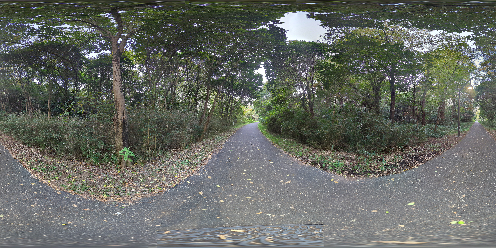
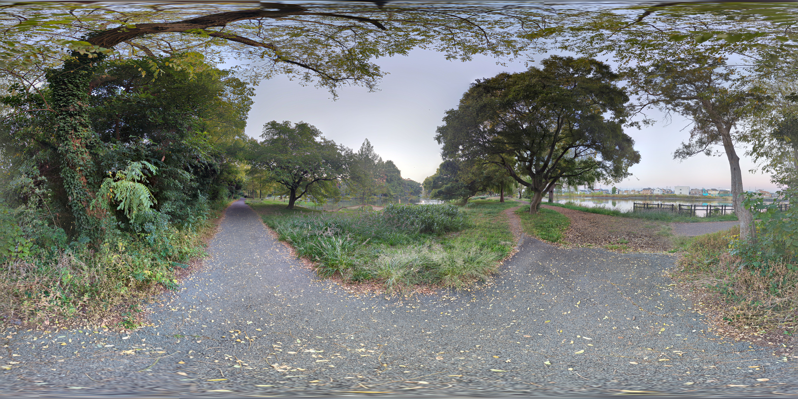
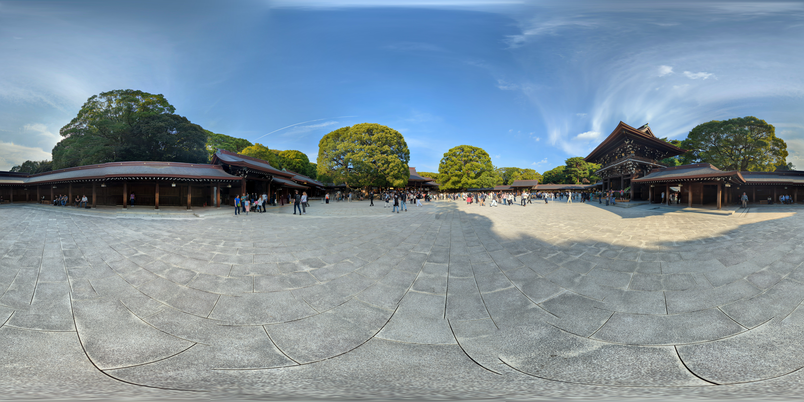
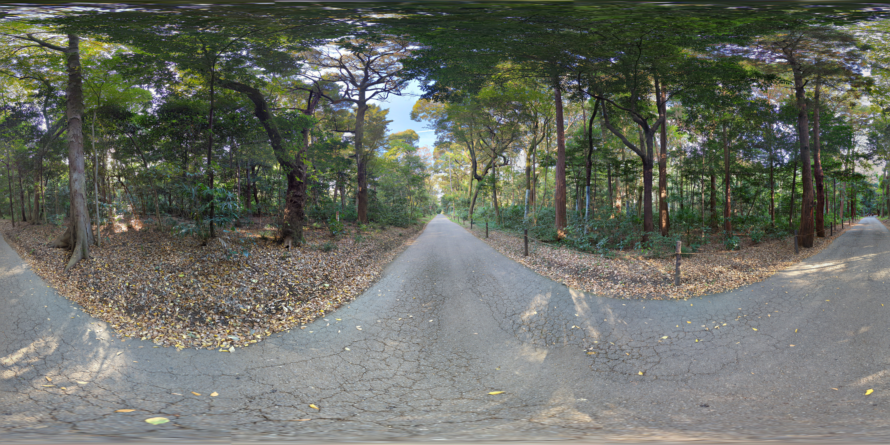

# 近況
## 11/3(金)
早いもので今年も残り1ヶ月で終わりです。

10月は激動で色々とすり減ってしまうことも多かったですが、まあ何とか乗り切り目標も何とか達成....

というわけで今日はヘッドスパに行った後に近所の水元公園に寄ってきました。

東京都でここまで緑が多い場所と言えばここと明治神宮が思い当たりますが、まったり出来る分、自分は水元公園の方が好みではあります。

## 11/4
明治神宮に行ってきました。

やはりいつもに増して外国人観光客の方が多数来場されていました。

連休ということもあってか、純粋に人が多かったです。

# 終わりに
色々とリラックスすることができました。

そろそろ森林は食傷気味なので別の場所にも行こうとは思いますが...

では(´・ω・`)ﾉｼ

