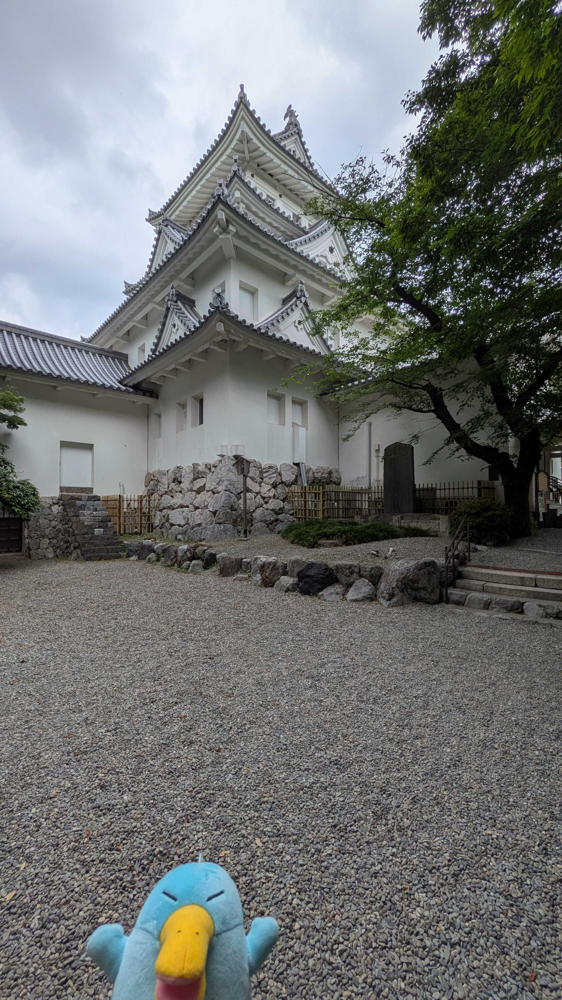
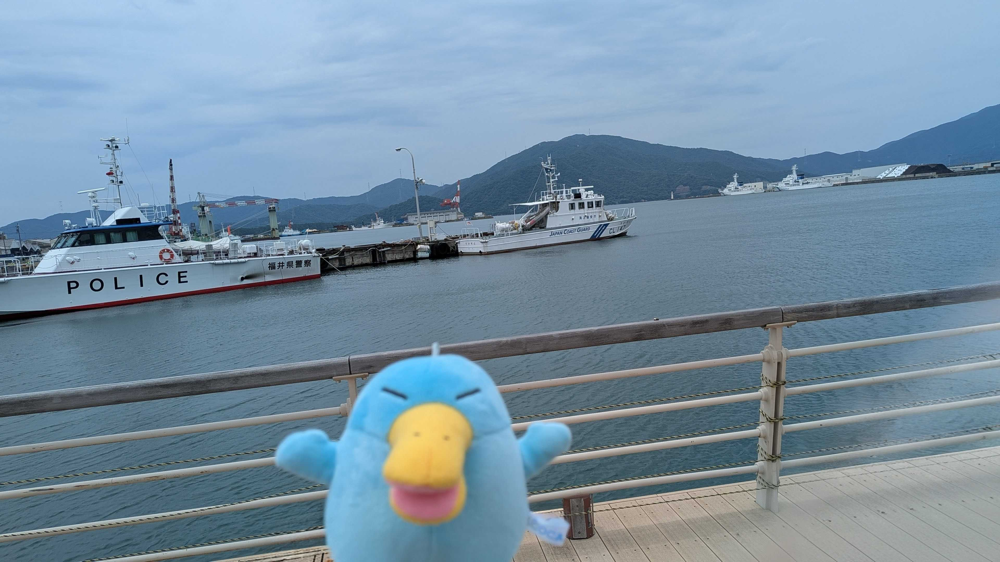

## 5/6 熊本
GWは関西の実家に戻り、そのつてで熊本まで行った。\
そこら中にくまもんのモニュメントがあった..w

---
## 6/14 大垣
岐阜の大垣に行った。\
下調べせずに行ったけど、目ぼしい所はなかった。

大垣城でパシャリ(上手く取れてない...)

---
## 7/4 福井
武生～敦賀に行った。\
敦賀は町中に銀河鉄道999のモニュメントがあったり、港があったりと見どころ満載だった。

---
## おわりに
7月も下旬に差し掛かっている(早い...)\
8月は用事で博多に行く予定があったり、郡山や函館にも行く予定なので、イコちゃんもワクワクしてそうだ。

