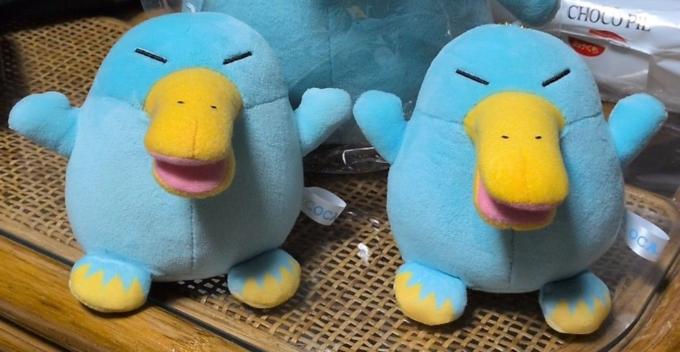
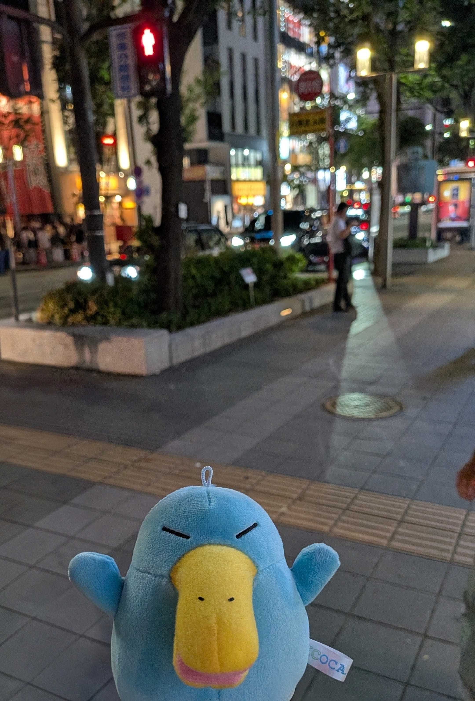
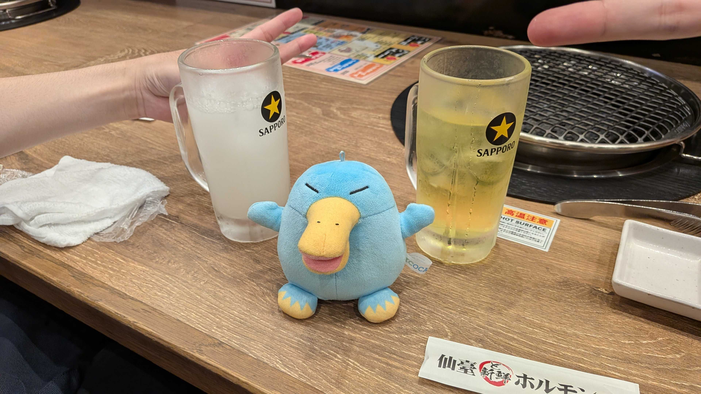
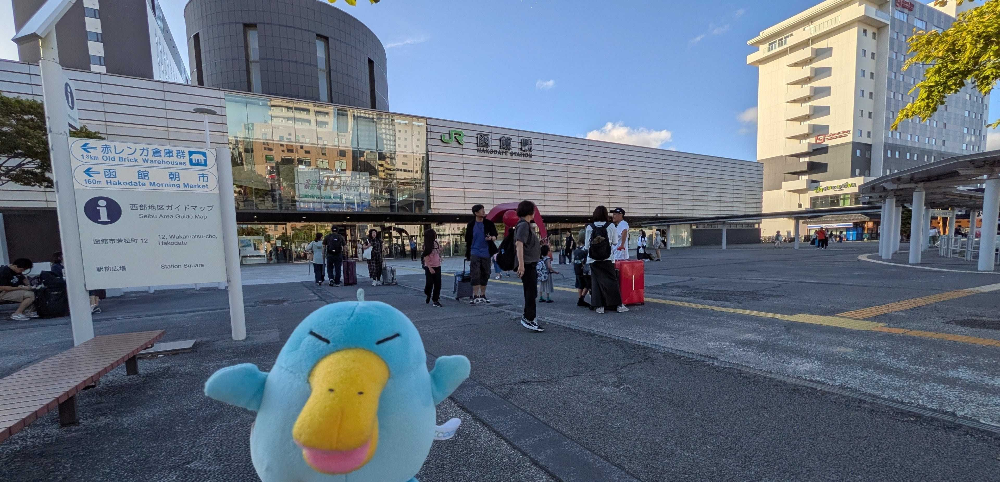
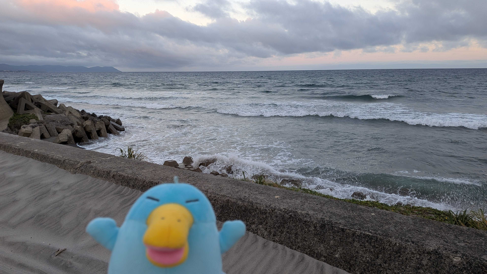
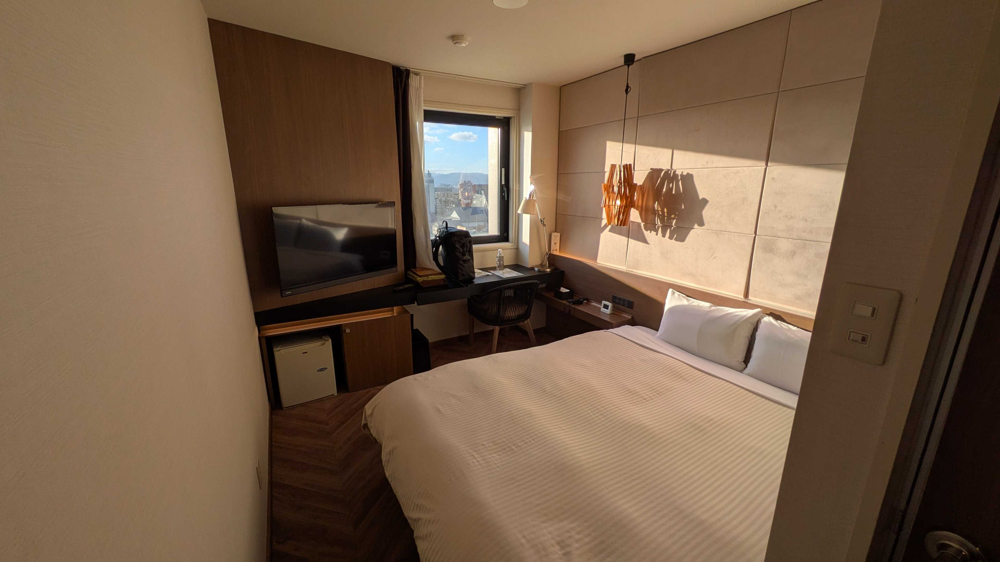
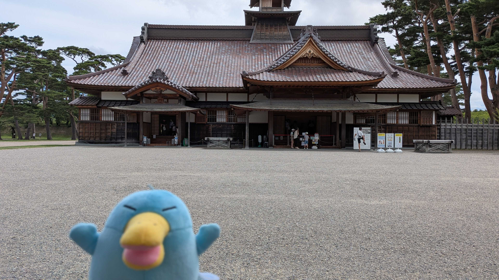

# 活動報告するその前に...
**イコちゃんがもう一体増えた!!**  
~~おかんが買ったもう一体をパクって帰った~~ 連れて帰った。

←1号 2号→  

2体連れていくと荷物になるし、  
かといって連れていく方が偏るのもよくない...

ということで2号は博多、1号は郡山・函館に連れてくことにした。

# 8/6 ~ 7 博多
旅行ではなく出張。  
夜の博多は屋台とかも賑わっていてイコちゃん2号もウキウキだった。  
(けどめっちゃ蒸し暑かった...)

# 8/15 ~ 16 郡山
出向で来ている友人を訪ねて郡山へ。  
郡山の名物と言えば思い浮かばず、とりあえず宮城牛を扱っている焼肉屋に行った。

1号とウェ～いw  

駅のデパートにデカいキャラのオブジェが置いてあったのでパシャリ。  

# 8/16 ~ 17 函館
郡山から仙台を経由して函館までいった。  
郡山もだったけど8月中旬なのに涼しかった。(函館は23℃くらいだった)

宿泊したグローバルビューホテル函館。  
温泉もベットも広めでイコちゃん1号もスヤスヤ~。

一夜明けて五稜郭へ  
展望台や[函館奉行所](https://hakodate-bugyosho.jp/)は結構混んでたので今回は中には入らず外からパシャリ。  
次に行くことがあったら函館山とか行きたいなあ。(あとはジンギスカン食いたい..)  

# おわりに
来月は連休があるけど、どこに行こうかは考えてない。  
前々から考えてた鳥取あたりに行くか...